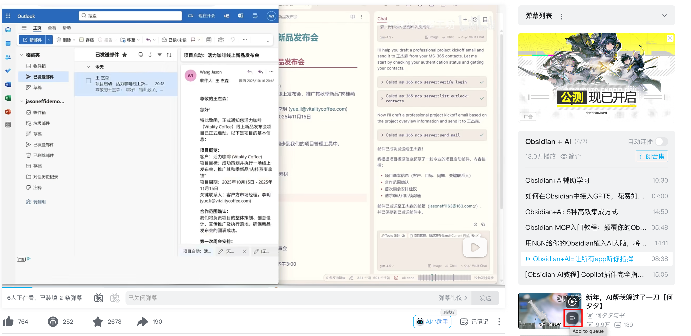

# BiliQueue - B站单标签临时播放队列增强

在哔哩哔哩（Bilibili）的主页、搜索页和播放页分别提供一个标签级的临时播放队列，方便用户将自己感兴趣的视频加入到临时播放列表来观看。

用完即弃，

# BiliQueue（哔哩队列）介绍

## 项目简介

BiliQueue 是一个面向 B 站的 Chrome 扩展，主打“单标签页、零打扰”的临时播放队列体验。
参考 YouTube 的使用体验, 通过在视频卡片上注入轻量操作按钮，实现快速将页面内感兴趣的视频加入到临时播放列表，而不必加入收藏夹或者稍后再看。

## 主要功能
- 单标签页隔离：队列仅在当前标签页生效，关闭标签即清空。
- 无确认交互：添加、移除、跳转不弹确认框，保持浏览流畅。
- 分别在主页、搜索、播放页 三处进行增强。

主页增强

搜索页增强

播放页增强

播放队列

## 目录结构
- `manifest.json`：扩展入口与权限配置（MV3）。
- `src/background/`：后台 Service Worker 与存储/消息路由。
- `src/content/`：内容脚本，负责 UI 注入与播放控制。
- `src/ui/`：队列面板 UI。
- `src/shared/`：共享存储与工具函数。
- `docs/`：设计、测试与发布检查清单。

## 安装与使用
1. 打开 `chrome://extensions`，启用「开发者模式」。
2. 点击「加载已解压的扩展程序」，选择仓库根目录。
3. 打开 `https://www.bilibili.com`，在视频卡片上悬浮使用「加入队列」按钮。
